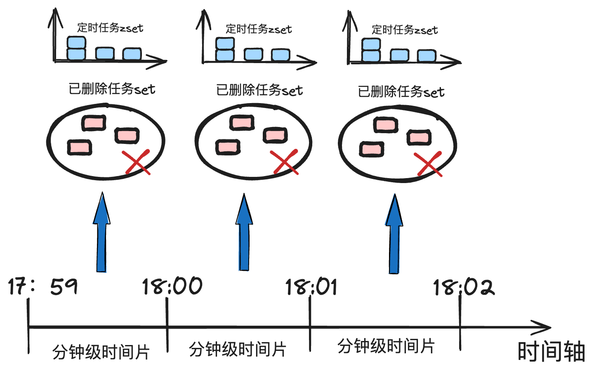

## 时间轮
参考视频：[小徐先生1212-时间轮算法原理与实战](https://www.bilibili.com/video/BV1k8411r7E4?p=4&spm_id_from=pageDriver&vd_source=12e0717abfb83627996003676740129e)

核心流程：

建立一个环状数据结构，每个刻度对应一个时间范围
- 创建定时任务时，根据距今的相对时长，推算出需要向后推移的刻度值
- 若来到环形数组的结尾，则重新从起点开始计算，但是记录时把执行轮次数加1
- 一个刻度可能存在多笔定时任务，所以每个刻度需要挂载一个定时任务链表

一个轮次对应的时间范围越长，在时间流逝过程中轮]()次的迭代速度就越慢，于是每个 slot 对应的定时任务链表长度就越短，执行定时任务时的检索效率就越高，采用多级时间轮的策略。

#### 分布式定时任务

Redis的zSet天然支持排序，利用timestamp可以轻松组织起一个任务列表。

- 为了避免redis产生庞大的数据集中在一个k-v对中，采用**多级时间轮等级制度**，以分钟的维度进行时间片的纵向划分，每个分钟级时间片对应一个独立的 zSet 有序表，保证每次执行任务时处理的数据规模仅为分钟的量级.
- **惰性删除机制**： 为了简化删除定时任务的流程. 在使用方指定删除定时任务时，我们不直接从 zSet 中删除数据，而是额外记录一个已删除任务的 set。 后续在检索定时任务时，通过使用 set 进行定时任务的过滤，实现定时任务的惰性删除



lua 脚本能够保证针在**单个 redis 节点内**执行的一系列指令具备原子性，中途不会被其他操作者打断。

redis 通常采用纵向分治的集群模式，这使得 key 不同的数据可能被分发在不同的 redis 节点上，此时 lua 脚本的性质就无法保证。

可以采用hash_tag来保证指定的 key 一定被分发到相同的 redis 节点上

[CLUSTER KEYSLOT | Redis](https://redis.io/commands/cluster-keyslot/)

示例：
```redis
> CLUSTER KEYSLOT somekey
(integer) 11058
> CLUSTER KEYSLOT foo{hash_tag}
(integer) 2515
> CLUSTER KEYSLOT bar{hash_tag}
(integer) 2515
```